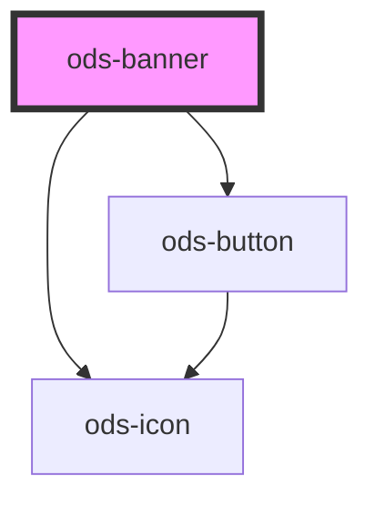

# ods-banner

<!-- Auto Generated Below -->

## Properties

| Property      | Attribute     | Description                                                                     | Type                              | Default     |
| ------------- | ------------- | ------------------------------------------------------------------------------- | --------------------------------- | ----------- |
| `active`      | `active`      | Displays the banner                                                             | `boolean`                         | `true`      |
| `content`     | `content`     | The human-readable content displayed along side the headline within the banner. | `string`                          | `undefined` |
| `dismissable` | `dismissable` | Displays a dismiss button for the banner                                        | `boolean`                         | `undefined` |
| `headline`    | `headline`    | The title of the banner.                                                        | `string`                          | `undefined` |
| `variant`     | `variant`     | Describes the visual variant for the banner.                                    | `"caution" \| "danger" \| "info"` | `'info'`    |

## Events

| Event       | Description                                                | Type                   |
| ----------- | ---------------------------------------------------------- | ---------------------- |
| `dismissed` | Event: Fired when the ods-banner is dismissed by the user. | `CustomEvent<boolean>` |

## Dependencies

### Depends on

- [ods-icon](../ods-icon)
- [ods-button](../ods-button)

### Graph

----------------------------------------------

*Built with [StencilJS](https://stenciljs.com/)*
