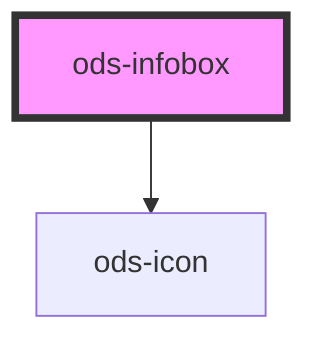

# ods-infobox

<!-- Auto Generated Below -->

## Properties

| Property   | Attribute  | Description                                                                      | Type                                           | Default     |
| ---------- | ---------- | -------------------------------------------------------------------------------- | ---------------------------------------------- | ----------- |
| `content`  | `content`  | The human-readable content displayed along side the headline within the infobox. | `string`                                       | `undefined` |
| `headline` | `headline` | The title of the infobox.                                                        | `string`                                       | `undefined` |
| `variant`  | `variant`  | Describes the visual variant for the infobox.                                    | `"caution" \| "danger" \| "info" \| "success"` | `'info'`    |

## Dependencies

### Depends on

- [ods-icon](../ods-icon)

### Graph

----------------------------------------------

*Built with [StencilJS](https://stenciljs.com/)*
