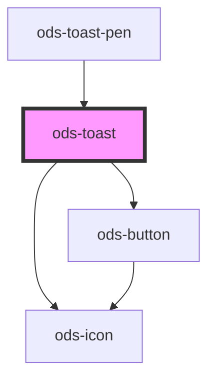

# ods-toast

<!-- Auto Generated Below -->

## Properties

| Property  | Attribute | Description                                    | Type                                           | Default     |
| --------- | --------- | ---------------------------------------------- | ---------------------------------------------- | ----------- |
| `active`  | `active`  | Displays the banner                            | `boolean`                                      | `true`      |
| `body`    | `body`    | Body text displayed beaneath the toast title   | `string`                                       | `undefined` |
| `heading` | `heading` | Title message displayed on the toast           | `string`                                       | `undefined` |
| `variant` | `variant` | Describes the visual variant the toast banner. | `"caution" \| "danger" \| "info" \| "success"` | `undefined` |

## Events

| Event       | Description                                   | Type                   |
| ----------- | --------------------------------------------- | ---------------------- |
| `dismissed` | Event: Fired when the ods-toast is dismissed. | `CustomEvent<boolean>` |

## Dependencies

### Used by

 - [ods-toast-pen](../ods-toast-pen)

### Depends on

- [ods-icon](../ods-icon)
- [ods-button](../ods-button)

### Graph

----------------------------------------------

*Built with [StencilJS](https://stenciljs.com/)*
