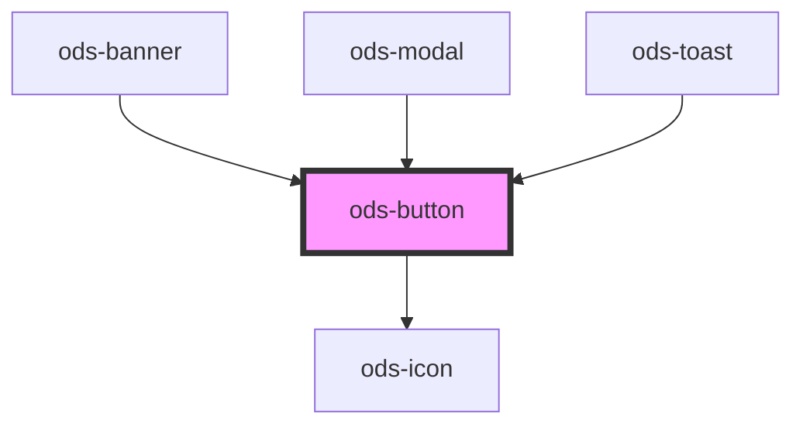

# ods-button

<!-- Auto Generated Below -->

## Properties

| Property   | Attribute  | Description                                  | Type                                                                        | Default     |
| ---------- | ---------- | -------------------------------------------- | --------------------------------------------------------------------------- | ----------- |
| `disabled` | `disabled` | Disables the button                          | `boolean`                                                                   | `undefined` |
| `variant`  | `variant`  | Describes the visual variant for the button. | `"clear" \| "danger" \| "dismiss" \| "overlay" \| "primary" \| "secondary"` | `undefined` |

## Dependencies

### Used by

 - [ods-banner](../ods-banner)
 - [ods-modal](../ods-modal)
 - [ods-toast](../ods-toast)

### Depends on

- [ods-icon](../ods-icon)

### Graph

----------------------------------------------

*Built with [StencilJS](https://stenciljs.com/)*
