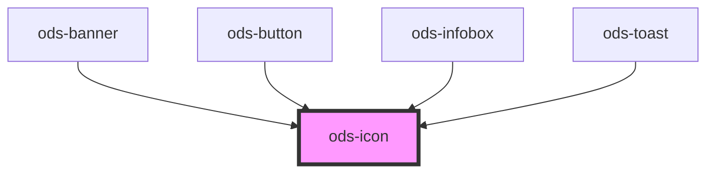

# ods-icon

<!-- Auto Generated Below -->

## Properties

| Property | Attribute | Description                                | Type                                                                                                                                                                                                                                | Default     |
| -------- | --------- | ------------------------------------------ | ----------------------------------------------------------------------------------------------------------------------------------------------------------------------------------------------------------------------------------- | ----------- |
| `type`   | `type`    | Describes the visual variant for the icon. | `"caution" \| "close" \| "complete" \| "copy" \| "delete" \| "download" \| "edit" \| "error" \| "filter" \| "get-info" \| "go-backward" \| "go-forward" \| "minus" \| "notification" \| "plus" \| "search" \| "settings" \| "user"` | `undefined` |

## Dependencies

### Used by

 - [ods-banner](../ods-banner)
 - [ods-button](../ods-button)
 - [ods-infobox](../ods-infobox)
 - [ods-toast](../ods-toast)

### Graph

----------------------------------------------

*Built with [StencilJS](https://stenciljs.com/)*
