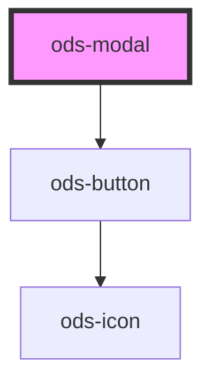

# ods-modal

<!-- Auto Generated Below -->

## Properties

| Property | Attribute | Description                          | Type      | Default |
| -------- | --------- | ------------------------------------ | --------- | ------- |
| `active` | `active`  | Determines the display of the modal. | `boolean` | `false` |

## Dependencies

### Depends on

- [ods-button](../ods-button)

### Graph

----------------------------------------------

*Built with [StencilJS](https://stenciljs.com/)*
